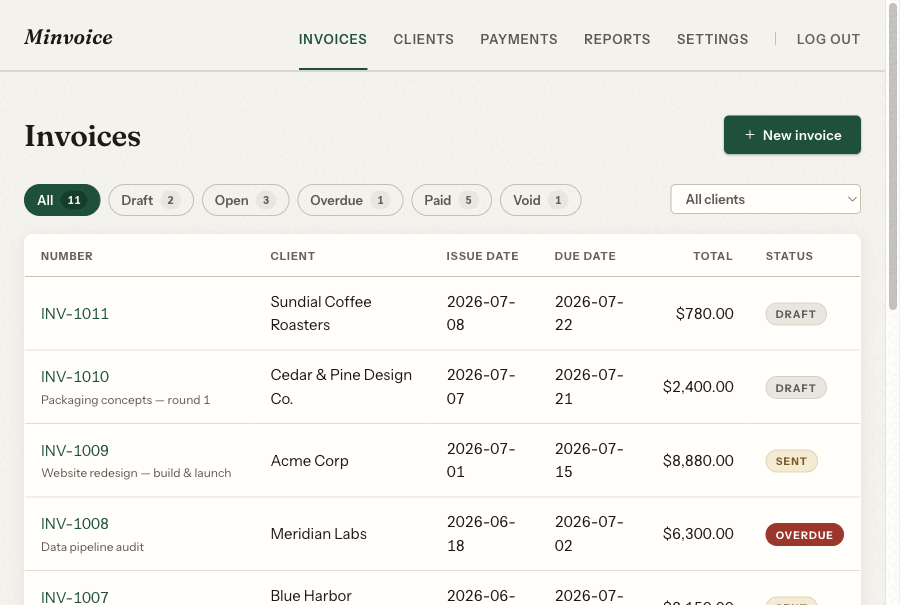
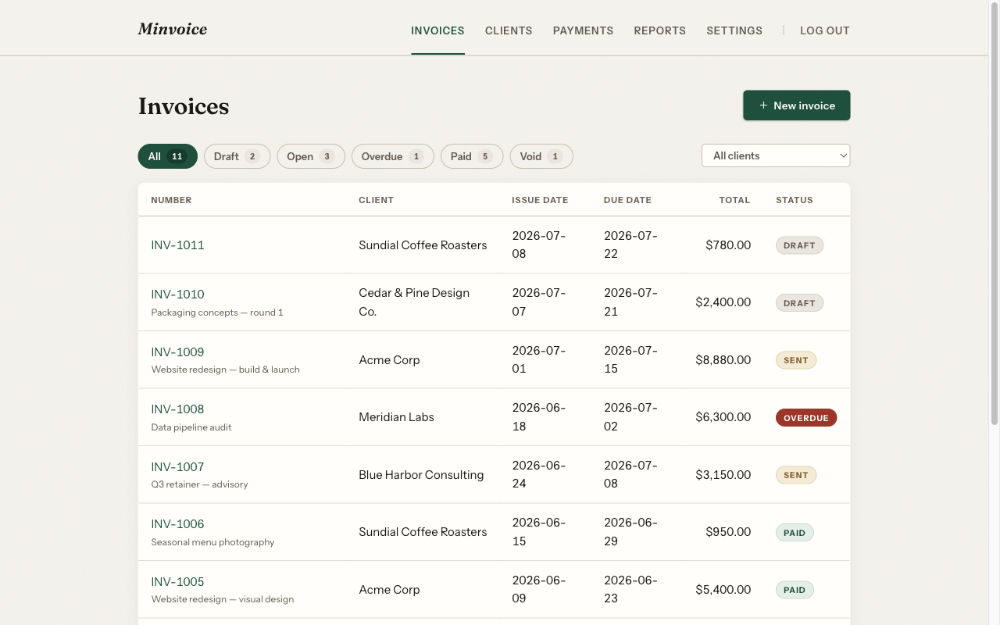
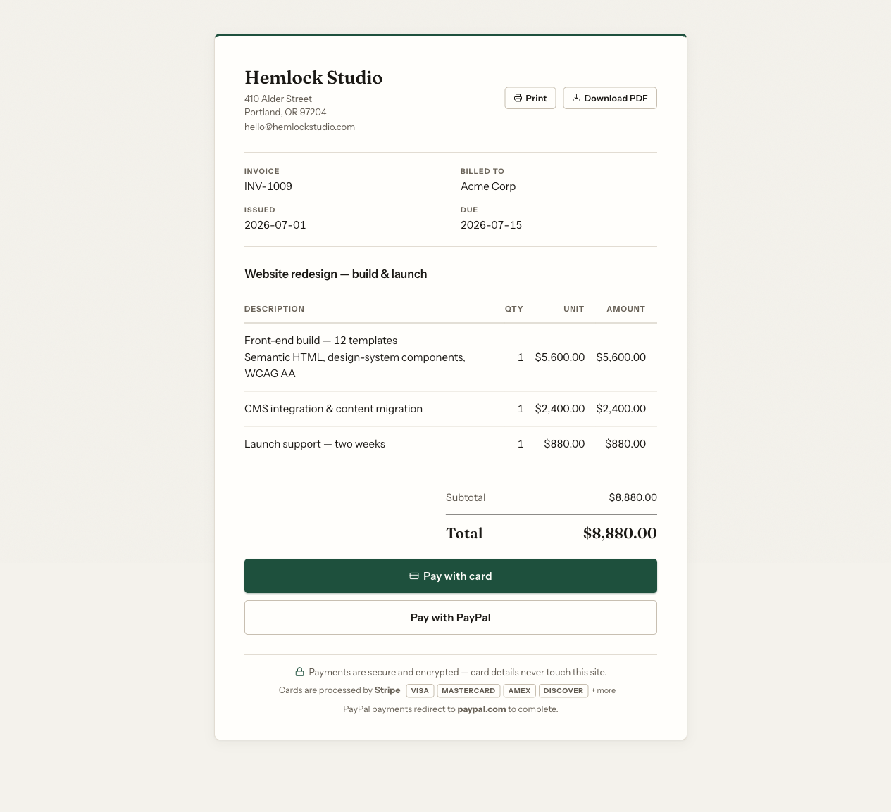
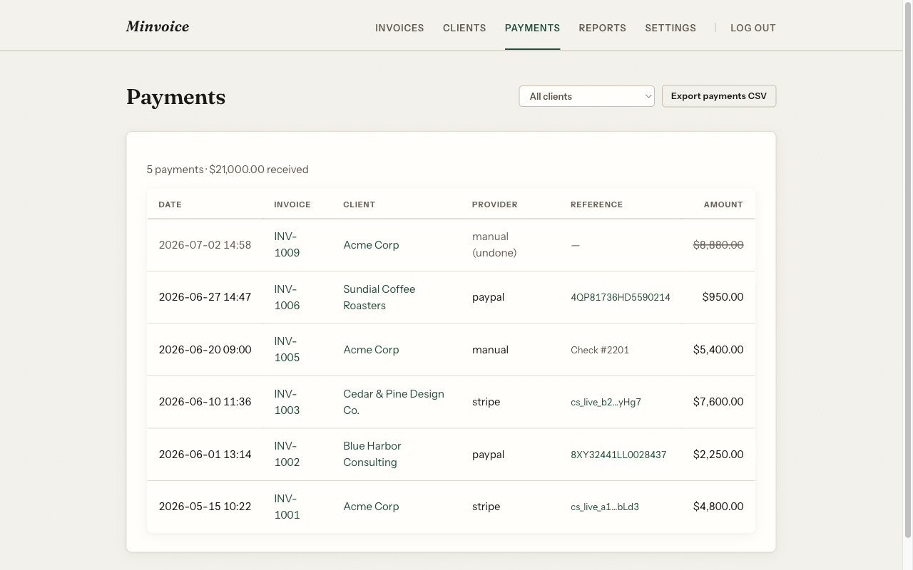
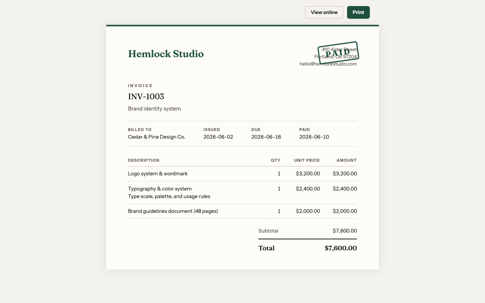

# Minvoice

Minvoice (**min**imal in**voice**) is single-business invoicing that runs entirely on Cloudflare —
Workers, D1, Access, and Email Sending. Create invoices, email them with a PDF attached, get paid
by card (Stripe Checkout) or PayPal, and keep clean books. No servers, no framework runtime, no
third-party requests on any page. Designed for one business (you), not as a SaaS.

[](https://deploy.workers.cloudflare.com/?url=https://github.com/ddyy/minvoice)

One click gets you: the repo cloned to your GitHub, a D1 database provisioned and migrated, a
password-protected admin (set the `ADMIN_PASSWORD` secret when prompted), and the setup wizard on
first visit — a working invoicing app on workers.dev. Connect payments, email, and Cloudflare
Access at your own pace afterward (see Setup below).

Everything beyond the Worker itself is optional:

- **Custom domain** — optional. Everything works on the free workers.dev domain; the only feature
  that needs a custom domain is Cloudflare Access for admin auth, and the built-in password login
  covers that until you add one.
- **Payments** — optional, and Stripe and PayPal are each optional too: connect either, both, or
  neither. With none connected, clients still get the invoice page, print view, and PDF — and you
  record checks or bank transfers manually, which keeps the books just the same.
- **Email** — optional. Send through Cloudflare Email Sending or Resend, or turn email off in
  Settings and share pay links directly.



| | |
|---|---|
| [](docs/screenshots/dashboard.png) | [](docs/screenshots/pay-page.png) |
| [](docs/screenshots/payments-history.png) | [](docs/screenshots/print-view.png) |

## Features

- **Invoices** — line items with multi-line descriptions, subjects, per-client payment terms and
  default rates, custom or auto numbering (including dated prefixes like `{YYYY}{MM}{DD}` with a
  per-day counter), duplicate-invoice, and full-status delete with guardrails
- **Get paid** — unguessable pay links (20-char, 100-bit tokens) with hosted Stripe Checkout and
  PayPal buttons; webhooks are the source of truth, fully idempotent, and record each payment
  atomically (event, payment, and status change commit or roll back together); receipts and
  "you got paid" notifications are enqueued in that same transaction and delivered with retries
  (at-least-once — a rare duplicate beats a silent never)
- **Documents** — a print-optimized invoice view (one-click print, `PAID`/`VOID` stamps) and a
  generated PDF (pdf-lib) attached to invoice emails
- **History** — every invoice keeps an activity timeline: edits, sends, payments (with undo),
  and pay-link views with city-level geolocation (bot- and scanner-filtered, admin views excluded)
- **Email** — Cloudflare Email Sending or Resend, selectable in Settings
- **Payment reminders** — opt-in daily cron emails overdue clients on an editable schedule
  (default 1, 7, and 14 days past due, up to 10 reminders, burst-protected); every reminder is
  logged to the invoice history and delivered through a durable outbox that retries failures
- **Admin** — dashboard with status tabs and client filter, payments list, monthly reports
  (filterable by client), CSV export,
  first-launch setup wizard, configuration warnings for missing secrets
- **No fees** — fits Cloudflare's free tier (Resend's free tier covers email there), so there's
  no monthly cost to run. No subscription and no added payment fees on any plan: you pay only
  Stripe's or PayPal's own rate (2.9% + 30¢ on card), straight to your own account. Nothing sits
  in between taking a cut
- **Your data stays yours** — books live in a D1 database in *your* Cloudflare account; no
  analytics, no tracking, no third-party requests on any page. Payment providers see only the
  charge itself, and clients' invoice pages are unindexed, unguessable URLs
- **Ledger design** — a warm, print-inspired design system (Fraunces + Instrument Sans,
  self-hosted); Lighthouse 100 performance and accessibility on the payment page, WCAG AA contrast

## Architecture

```
src/
  index.tsx             Hono app: routes, Access middleware on /admin/*, /health, styled 404
  middleware/access.ts  Cloudflare Access JWT verification (defense in depth, fails closed)
  routes/               admin.tsx (dashboard/CRUD/reports/CSV), pay.tsx (public), webhooks.ts
  services/             stripe.ts, paypal.ts, pdf.ts, email.ts
  db/queries.ts         typed D1 access, webhook idempotency, timeline assembly
  views/                server-rendered JSX (hono/jsx) — no client framework
  lib/                  money (integer cents, bps tax), dates (timezone), tokens, config
migrations/             D1 schema migrations
public/                 styles.css, self-hosted fonts, favicon
```

Invariants worth knowing before you change anything:

- Money is **integer cents**; tax rates are basis points; totals are computed once and stored.
- "Paid" comes from **webhooks**, deduplicated by `UNIQUE(provider, event_id)` +
  `UNIQUE(provider, provider_ref)` + status-guarded updates — replays are no-ops, and payment
  emails fire only on the actual transition.
- Payments are soft-deleted (undo keeps history); storage is UTC with a business-timezone setting
  driving display and date logic.
- `/admin` requires a valid Cloudflare Access JWT verified in-Worker: if Access is misconfigured
  or disabled at the edge, admin **fails closed** with 403.

## Setup

You'll need: a Cloudflare account, a domain on Cloudflare, a Stripe account, and optionally a
PayPal Business account.

**Plans:** the Workers **Free** plan is enough — D1's free tier (5 GB, 5M reads/day) vastly
exceeds single-business invoicing volume — *if* you use **Resend** as the email provider (free
tier: 3,000 emails/month). The built-in **Cloudflare Email Sending** path requires the Workers
Paid plan to send to arbitrary recipients (your clients).

Prefer the CLI over the deploy button? `npm create minvoice` scaffolds a fresh copy — repo
downloaded, dependencies installed, fresh git history — and prints these same steps.

### 1. Create the database and config

The checked-in `wrangler.jsonc` is a zero-config starter (workers.dev, request-derived URLs).
`wrangler.jsonc.example` shows the full production shape — custom domain, Access, Cloudflare
email binding, staging — to graft in as you upgrade.

```sh
npm install
npx wrangler d1 create minvoice   # paste the printed id into wrangler.jsonc (database_id)
npx wrangler types
npm run db:migrate:remote         # deploy scripts also run this automatically
```

### 2. Local development

```sh
cp .dev.vars.example .dev.vars   # set ADMIN_PASSWORD (any value locally); test-mode Stripe key, sandbox PayPal creds
npx wrangler d1 migrations apply minvoice --local
npm run dev                      # http://localhost:8787 — first visit runs the setup wizard
```

Local Stripe webhooks: `stripe listen --forward-to localhost:8787/webhooks/stripe` and put the
printed `whsec_…` in `.dev.vars`. PayPal needs no local webhook — capture-on-return keeps the
books correct. Note `.dev.vars` changes require a dev-server restart.

### 3. Admin auth: password to start, Cloudflare Access when ready

Admin auth picks the strongest configured mode automatically:

- **Quick start — password:** `npx wrangler secret put ADMIN_PASSWORD` and you can sign in at
  `/admin` immediately (signed 7-day session cookie, timing-safe checks, throttled failures).
  The dashboard will nudge you toward Access.
- **Recommended — Cloudflare Access:** phishing-resistant SSO in front of `/admin`, verified
  in-Worker on every request. Setting it up **disables the password login automatically** —
  Access always wins. Walkthrough below.
- **Neither configured:** `/admin` fails closed with setup instructions.

#### Setting up Cloudflare Access, step by step

**Prerequisite: a custom domain.** Access cannot protect `*.workers.dev` hostnames, so first put
your domain on Cloudflare and attach it to the Worker — add a `routes` block to `wrangler.jsonc`
(see `wrangler.jsonc.example`) and deploy once so the hostname is live.

1. Open [Zero Trust](https://one.dash.cloudflare.com). First visit ever? You'll be asked to
   create an organization and pick a **team name** — choose carefully, because
   `<team-name>.cloudflareaccess.com` becomes your `ACCESS_TEAM_DOMAIN`.
2. Go to **Access → Applications → Add an application → Self-hosted**.
3. Name it (e.g. "Minvoice admin"). Under the public hostname, set **domain** to your Worker's
   hostname (e.g. `invoice.example.com`) and **path** to `admin`.
4. Add an **Allow** policy with **Include → Emails → your email address**.
5. Login method: new orgs default to the **Cloudflare identity provider** (sign in with your
   Cloudflare account — solid, MFA-backed). Heads-up: its consent screen briefly shows
   *"Unknown app wants to access your account"*; that's cosmetic and Cloudflare-side. Prefer
   emailed codes instead? Add **One-Time PIN** under Integrations → Identity providers and select
   it in the application's login methods.
6. Save, then open the application's overview and copy the **Application Audience (AUD) Tag**.
7. Put both values in `wrangler.jsonc` — `ACCESS_TEAM_DOMAIN` (from step 1) and `ACCESS_AUD`
   (from step 6) — and `npm run deploy`.
8. **Verify**: in a private window, `https://yourhost/admin` should redirect to your
   `*.cloudflareaccess.com` login; after signing in you land in the admin. The dashboard's
   "password-based auth" warning disappears — Access has retired the password.

Notes:
- **Fail-closed by design**: if the AUD or team domain is wrong — or Access is later disabled at
  the edge — `/admin` returns 403 rather than falling open. If you get a 403 *after* the Access
  login succeeds, one of the two values in `wrangler.jsonc` doesn't match the application.
- **Staging** shares the app: add the staging hostname as an **additional domain on the same
  application** (same AUD for both) instead of creating a second app.
- Your own pay-page visits stop being logged to invoice History once Access is active — the
  view tracking recognizes the Access session cookie.

### 4. Email

Two providers, selectable in Settings:

- **Resend** (default for the starter config): verify your domain at Resend and set the
  `RESEND_API_KEY` secret. Free tier covers invoicing volume, works on the Workers Free plan.
- **Cloudflare Email Sending**: onboard your domain (dashboard → Email Service) and add the
  `send_email` binding from `wrangler.jsonc.example` (requires Workers Paid to send to clients).

Either way, set the From address in Settings after first launch — sends fail loudly until it's
set, and the dashboard warns about any provider misconfiguration.

### 5. Secrets and deploy

Only `ADMIN_PASSWORD` is needed up front (the one-click flow prompts for exactly that). Payment
and Resend keys can be added **either** in-app (Settings → Payments & keys — stored in D1, zero
CLI) **or** as Wrangler secrets, which are encrypted at rest, excluded from database exports, and
**always take precedence** — the hardened choice. Each payment method also has an on/off toggle
in Settings. Pay buttons stay hidden and the dashboard warns until a method is configured:

```sh
npx wrangler secret put ADMIN_PASSWORD          # unless you configured Access in step 3
npx wrangler secret put STRIPE_SECRET_KEY       # restricted key: Checkout Sessions write
npx wrangler secret put STRIPE_WEBHOOK_SECRET   # after registering the webhook (below)
npx wrangler secret put PAYPAL_CLIENT_ID
npx wrangler secret put PAYPAL_CLIENT_SECRET
npx wrangler secret put PAYPAL_WEBHOOK_ID
npx wrangler secret put RESEND_API_KEY          # if using Resend for email
npm run deploy
```

Register webhooks pointing at your domain:

- Stripe → `https://yourhost/webhooks/stripe`, events `checkout.session.completed` and
  `checkout.session.async_payment_succeeded`
- PayPal → `https://yourhost/webhooks/paypal`, event `PAYMENT.CAPTURE.COMPLETED`

Payment buttons appear on pay pages only for providers whose credentials are configured — an
invoice-only deployment (no payment secrets yet) still produces shareable, printable invoices.

Visit `/admin`, complete the setup wizard, set the email From address in Settings, and send
yourself a test invoice. The dashboard warns about any missing configuration.

### Staging (optional, recommended)

The `env.test` block in `wrangler.jsonc.example` defines a full staging duplicate — its own D1,
hostname, and sandbox provider credentials — so fake money can never reach your real books.
`npm run deploy:test` / `npm run db:migrate:test`.

### Uptime monitoring (optional)

`GET /health` returns 200 only when the Worker and D1 both answer — point any external monitor
at it. If you firewall datacenter ASNs, exempt this path.

## Operations

- `npm run deploy` — applies pending D1 migrations (by binding name), then deploys
- `npm test` — unit tests over the money/date/timeline/config logic
- `npm run db:wipe:prod` — clear transactional data, keep settings (CLI-only by design)
- `npm run db:reset:prod` — factory reset; re-arms the setup wizard
- D1 Time Travel provides 30-day point-in-time restore; take periodic `wrangler d1 export`
  snapshots for older history

## License

MIT. Bundled fonts (Fraunces, Instrument Sans) are under the SIL Open Font License —
see [public/fonts/LICENSE](public/fonts/LICENSE).
